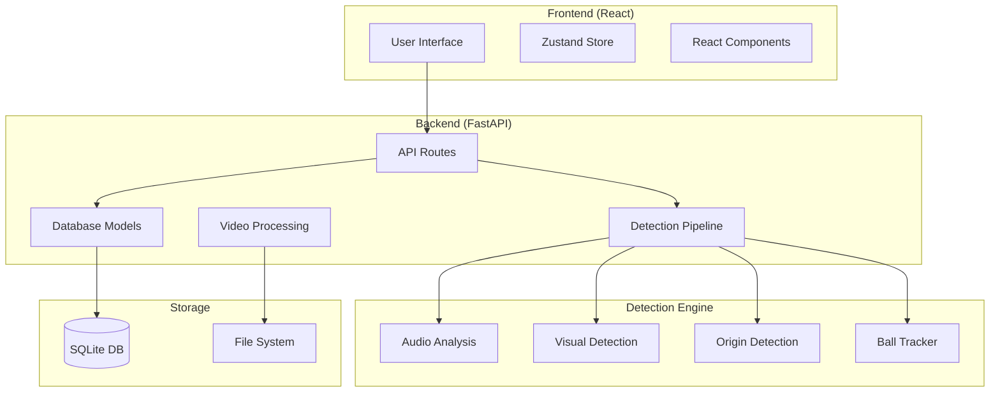
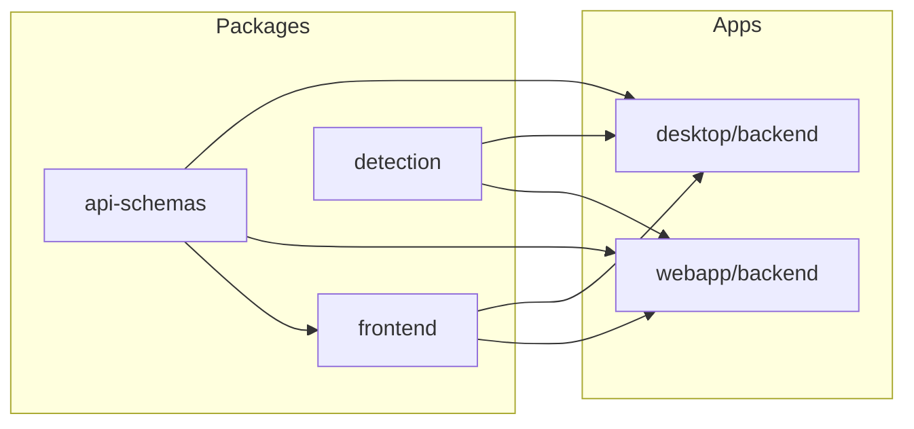
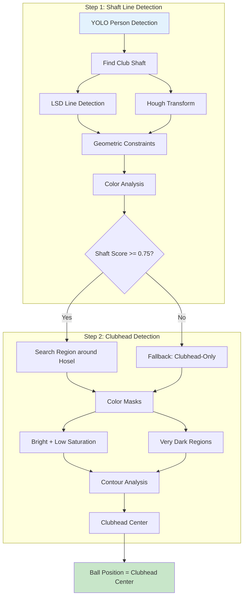
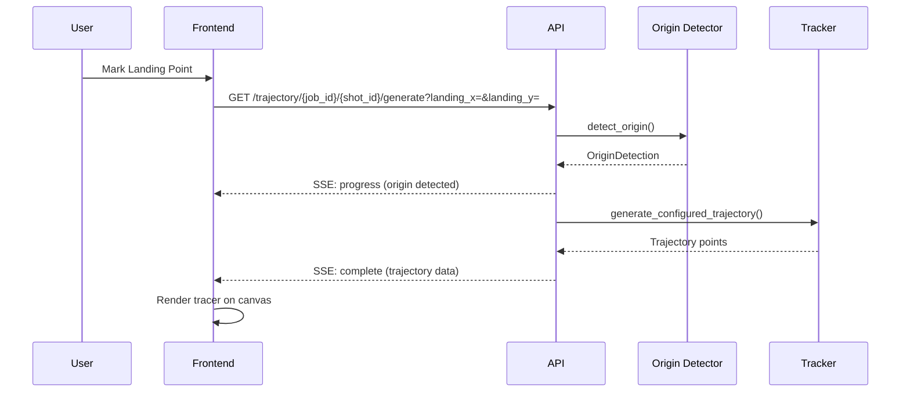
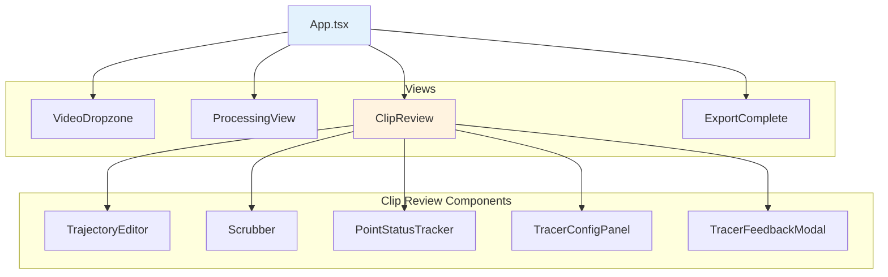
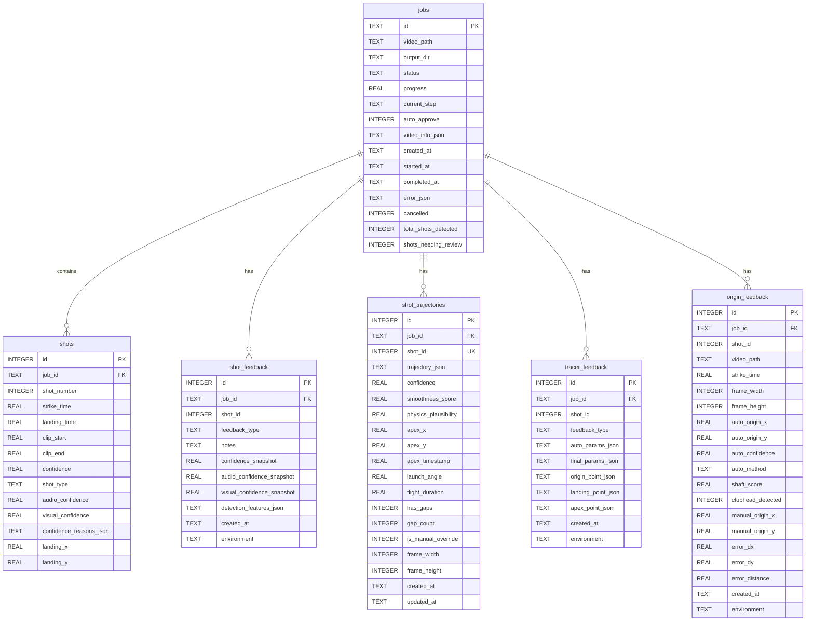

# GolfClip Architecture Documentation

Technical architecture reference for the GolfClip project - an AI-powered golf shot detection and clip export tool.

## Table of Contents

1. [System Overview](#1-system-overview)
2. [Detection Pipeline](#2-detection-pipeline)
3. [Ball Origin Detection Architecture](#3-ball-origin-detection-architecture)
4. [Trajectory Generation Pipeline](#4-trajectory-generation-pipeline)
5. [Frontend Component Architecture](#5-frontend-component-architecture)
6. [Database Schema](#6-database-schema)
7. [Data Flow Diagrams](#7-data-flow-diagrams)
8. [Technology Stack](#8-technology-stack)

---

## 1. System Overview

### High-Level Architecture



### Monorepo Structure

```
golf-clip/
├── packages/
│   ├── frontend/              # Shared React app (TypeScript + Vite)
│   │   └── src/
│   │       ├── App.tsx
│   │       ├── components/    # UI components
│   │       └── stores/        # Zustand state management
│   ├── detection/             # Shared ML/detection code (Python)
│   │   └── src/golfclip_detection/
│   └── api-schemas/           # Shared Pydantic schemas
├── apps/
│   ├── desktop/               # Desktop app (Tauri + SQLite)
│   │   └── backend/
│   │       ├── api/           # FastAPI routes
│   │       ├── core/          # Database, config
│   │       ├── detection/     # Shot detection algorithms
│   │       ├── models/        # CRUD operations
│   │       └── processing/    # Video/tracer rendering
│   └── webapp/                # Cloud webapp (PostgreSQL + R2)
│       └── backend/
├── scripts/                   # Development scripts
├── tests/                     # Root-level tests
└── docs/                      # Documentation
```

### Package Relationships



---

## 2. Detection Pipeline

### Full Pipeline Flow


### Detailed Pipeline Architecture

```
┌─────────────────────────────────────────────────────────────────────────────┐
│                         SHOT DETECTION PIPELINE                              │
├─────────────────────────────────────────────────────────────────────────────┤
│                                                                              │
│  ┌──────────────┐    ┌──────────────────┐    ┌──────────────────────┐       │
│  │    VIDEO     │───▶│ AUDIO EXTRACTION │───▶│ TRANSIENT DETECTION  │       │
│  │    INPUT     │    │  (ffmpeg-python) │    │     (librosa)        │       │
│  └──────────────┘    └──────────────────┘    └──────────────────────┘       │
│                                                        │                     │
│                                                        ▼                     │
│  ┌──────────────────────────────────────────────────────────────────┐       │
│  │                     AUDIO FEATURE EXTRACTION                      │       │
│  │  ┌─────────────┐ ┌──────────────┐ ┌─────────────┐ ┌───────────┐ │       │
│  │  │ Peak Height │ │ Spectral     │ │ Spectral    │ │ Peak      │ │       │
│  │  │    (20%)    │ │ Flatness(10%)│ │ Centroid(15%)│ │Prominence │ │       │
│  │  └─────────────┘ └──────────────┘ └─────────────┘ │   (15%)   │ │       │
│  │  ┌─────────────┐ ┌──────────────┐ ┌─────────────┐ └───────────┘ │       │
│  │  │ Rise Time   │ │ Decay Ratio  │ │Zero-Crossing│                │       │
│  │  │    (10%)    │ │    (20%)     │ │ Rate (10%)  │                │       │
│  │  └─────────────┘ └──────────────┘ └─────────────┘                │       │
│  └──────────────────────────────────────────────────────────────────┘       │
│                                    │                                         │
│                                    ▼                                         │
│                       ┌──────────────────────┐                               │
│                       │    DEDUPLICATION     │                               │
│                       │  (25s time window)   │                               │
│                       └──────────────────────┘                               │
│                                    │                                         │
│                                    ▼                                         │
│  ┌──────────────────────────────────────────────────────────────────┐       │
│  │                      VISUAL DETECTION                             │       │
│  │  ┌────────────┐   ┌────────────┐   ┌────────────┐                │       │
│  │  │YOLO Person │   │YOLO Ball   │   │ Motion     │                │       │
│  │  │ Detection  │   │ Detection  │   │ Detection  │                │       │
│  │  └────────────┘   └────────────┘   └────────────┘                │       │
│  └──────────────────────────────────────────────────────────────────┘       │
│                                    │                                         │
│                                    ▼                                         │
│                       ┌──────────────────────┐                               │
│                       │   CONFIDENCE SCORING │                               │
│                       │ Audio(40%)+Visual(60%)│                               │
│                       └──────────────────────┘                               │
│                                                                              │
└─────────────────────────────────────────────────────────────────────────────┘
```

### Audio Detection Feature Weights

| Feature | Weight | Description |
|---------|--------|-------------|
| Peak height | 20% | Transient amplitude relative to local mean |
| Spectral flatness | 10% | Noise-like vs tonal (strikes ~0.3) |
| Spectral centroid | 15% | Frequency "brightness" (strikes ~2500-4500 Hz) |
| Peak prominence | 15% | How much peak stands out from background |
| Rise time | 10% | Attack speed (strikes have fast attack <10ms) |
| Decay ratio | 20% | How quickly sound decays (strikes decay fast) |
| Zero-crossing rate | 10% | Helps filter swoosh sounds (practice swings) |

---

## 3. Ball Origin Detection Architecture

### Two-Step Detection Process



### Shaft Detection Geometric Constraints

```
                    ┌─────────────────────────────────────┐
                    │           GOLFER BBOX               │
                    │  ┌─────────────────────────────┐   │
                    │  │     y_min (hands area)      │   │
                    │  │            ╲                 │   │
                    │  │             ╲ SHAFT         │   │
                    │  │              ╲              │   │
                    │  │               ╲             │   │
                    │  │                ╲  15-60°    │   │
                    │  │                 ╲ angle     │   │
                    │  │                  ╲          │   │
                    │  │     y_max (feet)  ●─────────│───│── Hosel/Clubhead
                    │  └─────────────────────────────┘   │
                    └─────────────────────────────────────┘

    CONSTRAINTS:
    1. Grip end: between y_min and y_max (hands area)
    2. Hosel end: within ~50px of y_max (feet level)
    3. Line angle: 15-60° from horizontal
    4. Shaft direction: upper-left to lower-right
    5. Clubhead: at maximum x-value of the line
```

### Ball Origin Detection Code Flow

```
BallOriginDetector.detect_origin()
    │
    ├── _get_frame_at_time() ──────── Extract frame 2.5s before strike
    │
    ├── _detect_golfer_zone() ─────── YOLO person detection
    │       │                          Returns: bbox, feet_position, ball_zone
    │       └── BallDetector.detect_golfer_in_frame()
    │
    ├── _detect_shaft_endpoint() ──── Shaft + Clubhead detection
    │       │
    │       ├── _detect_lines_multi_method()
    │       │       ├── LSD (Line Segment Detector)
    │       │       └── Hough with multiple params
    │       │
    │       ├── Apply geometric constraints (angle, position, length)
    │       │
    │       ├── _analyze_line_color() ── Distinguish shaft from grass
    │       │
    │       ├── Score and select best candidate
    │       │
    │       └── _detect_clubhead_center()
    │               ├── HSV color masks (bright metallic, matte black)
    │               ├── Morphological cleanup
    │               └── Contour centroid extraction
    │
    └── _combine_detections() ─────── Priority: YOLO ball > Shaft > None
```

---

## 4. Trajectory Generation Pipeline

### SSE-Based Generation Flow



### Trajectory Generation Process

```
┌─────────────────────────────────────────────────────────────────────────────┐
│                    TRAJECTORY GENERATION PIPELINE                            │
├─────────────────────────────────────────────────────────────────────────────┤
│                                                                              │
│   USER INPUT                                                                 │
│   ┌──────────────┐     ┌──────────────┐     ┌──────────────┐               │
│   │ Landing Point│     │ Origin Point │     │ Configuration│               │
│   │  (required)  │     │(auto/manual) │     │  (optional)  │               │
│   └──────┬───────┘     └──────┬───────┘     └──────┬───────┘               │
│          │                    │                    │                        │
│          └────────────────────┼────────────────────┘                        │
│                               ▼                                              │
│   ┌──────────────────────────────────────────────────────────────────┐     │
│   │                    EARLY BALL DETECTION                           │     │
│   │  • First 200ms after strike                                       │     │
│   │  • Motion detection + frame differencing                          │     │
│   │  • Extract launch angle and lateral direction                     │     │
│   └──────────────────────────────────────────────────────────────────┘     │
│                               │                                              │
│                               ▼                                              │
│   ┌──────────────────────────────────────────────────────────────────┐     │
│   │                    PHYSICS MODEL                                  │     │
│   │  • Parabolic trajectory calculation                               │     │
│   │  • Apex height based on shot_height config                        │     │
│   │  • Flight duration from user input or derived                     │     │
│   │  • Gravity: g = 2 * apex_height / apex_time²                     │     │
│   └──────────────────────────────────────────────────────────────────┘     │
│                               │                                              │
│                               ▼                                              │
│   ┌──────────────────────────────────────────────────────────────────┐     │
│   │                    BEZIER SMOOTHING                               │     │
│   │  • Quadratic Bezier: B(t) = (1-t)²P₀ + 2(1-t)tP₁ + t²P₂         │     │
│   │  • Control point derived from apex requirements                   │     │
│   │  • Shot shape (draw/fade) adjusts control point X                 │     │
│   │  • Sine easing for natural ball physics feel                      │     │
│   └──────────────────────────────────────────────────────────────────┘     │
│                               │                                              │
│                               ▼                                              │
│   ┌──────────────────────────────────────────────────────────────────┐     │
│   │                    OUTPUT                                         │     │
│   │  • 60 points/second (60fps animation)                             │     │
│   │  • Normalized coordinates (0-1)                                   │     │
│   │  • Apex point marked                                              │     │
│   │  • Stored in shot_trajectories table                              │     │
│   └──────────────────────────────────────────────────────────────────┘     │
│                                                                              │
└─────────────────────────────────────────────────────────────────────────────┘
```

### Trajectory Configuration Parameters

```
┌──────────────────────────────────────────────────────────────────┐
│                    TRAJECTORY CONFIG                              │
├──────────────────────────────────────────────────────────────────┤
│                                                                   │
│  Starting Line:  ← LEFT ─── CENTER ─── RIGHT →                   │
│                                                                   │
│  Shot Shape:     ← HOOK ── DRAW ── STRAIGHT ── FADE ── SLICE →  │
│                                                                   │
│  Shot Height:    LOW ─────── MEDIUM ─────── HIGH                 │
│                  (apex 55%)   (apex 25%)    (apex 5%)            │
│                                                                   │
│  Flight Time:    [1.0s ═══════════════════════════════ 10.0s]   │
│                                                                   │
└──────────────────────────────────────────────────────────────────┘
```

---

## 4b. Browser Export Pipeline (V4)

The browser app exports clips client-side using WebCodecs API with a two-pass real-time capture approach.

### V4 Pipeline Architecture

```
┌─────────────────────────────────────────────────────────────────────────────┐
│                    V4 TWO-PASS EXPORT PIPELINE                               │
├─────────────────────────────────────────────────────────────────────────────┤
│                                                                              │
│  PASS 1: REAL-TIME CAPTURE                                                  │
│  ┌────────────────────────────────────────────────────────────────────┐    │
│  │  video.play()                                                       │    │
│  │       │                                                             │    │
│  │       ▼                                                             │    │
│  │  requestVideoFrameCallback() ─────────────────────┐                │    │
│  │       │                                           │                │    │
│  │       ▼                                           │                │    │
│  │  captureCtx.drawImage(video, 0, 0, width, height) │  ◀── Loop     │    │
│  │       │                                           │      until     │    │
│  │       ▼                                           │      endTime   │    │
│  │  createImageBitmap(captureCanvas)                 │                │    │
│  │       │                                           │                │    │
│  │       ▼                                           │                │    │
│  │  capturedBitmaps.push({ bitmap, timeUs }) ────────┘                │    │
│  └────────────────────────────────────────────────────────────────────┘    │
│                              │                                              │
│                              ▼                                              │
│  PASS 2: ENCODING                                                           │
│  ┌────────────────────────────────────────────────────────────────────┐    │
│  │  for (bitmap of capturedBitmaps):                                   │    │
│  │       │                                                             │    │
│  │       ▼                                                             │    │
│  │  ctx.drawImage(bitmap, 0, 0)  ───▶  Draw video frame               │    │
│  │       │                                                             │    │
│  │       ▼                                                             │    │
│  │  drawTracer(ctx, trajectory, time)  ───▶  Composite tracer         │    │
│  │       │                                                             │    │
│  │       ▼                                                             │    │
│  │  new VideoFrame(canvas, { timestamp })                              │    │
│  │       │                                                             │    │
│  │       ▼                                                             │    │
│  │  encoder.encode(frame, { keyFrame: i % 30 === 0 })                  │    │
│  └────────────────────────────────────────────────────────────────────┘    │
│                              │                                              │
│                              ▼                                              │
│  FINALIZATION                                                               │
│  ┌────────────────────────────────────────────────────────────────────┐    │
│  │  encoder.flush() → muxer.finalize() → new Blob([buffer])           │    │
│  └────────────────────────────────────────────────────────────────────┘    │
│                                                                              │
└─────────────────────────────────────────────────────────────────────────────┘
```

### Key Implementation Details

| Aspect | Implementation | Why |
|--------|---------------|-----|
| Capture resolution | Output (e.g., 1080p) | Capturing at 4K is too slow, causes frame drops |
| Frame source | Canvas, not video | `createImageBitmap(video)` returns black in some browsers |
| Two-pass design | Capture first, encode after | Encoding is slow; would miss frames if done in callback |
| Timestamp handling | `firstTimestampBehavior: 'offset'` | Clips don't start at t=0; muxer auto-offsets |
| Keyframes | Every 30 frames | Balance between file size and seek performance |

### Pipeline Comparison

| Pipeline | Method | Speed | FPS | Status |
|----------|--------|-------|-----|--------|
| V4 | requestVideoFrameCallback | ~0.85x realtime | Source FPS (60) | **Recommended** |
| V3 | Frame-by-frame seek | 5-8 min for 4K | 30 fixed | Fallback |
| V1 | FFmpeg WASM | Very slow, hangs | Varies | Deprecated |

### Key Files

| File | Purpose |
|------|---------|
| `video-frame-pipeline-v4.ts` | V4 real-time capture + WebCodecs encoding |
| `video-frame-pipeline-v3.ts` | V3 seek-based fallback pipeline |
| `ClipReview.tsx` | Export UI with resolution dropdown |

---

## 5. Frontend Component Architecture

### Component Hierarchy



### Component Responsibilities

```
┌─────────────────────────────────────────────────────────────────────────────┐
│                         FRONTEND COMPONENTS                                  │
├─────────────────────────────────────────────────────────────────────────────┤
│                                                                              │
│  App.tsx                                                                     │
│  ├── View routing based on job status                                        │
│  ├── API URL configuration                                                   │
│  └── Global error handling                                                   │
│                                                                              │
│  VideoDropzone.tsx                                                           │
│  ├── File upload via drag-and-drop or click                                  │
│  ├── Multi-video queue support                                               │
│  └── Dev mode: manual path entry                                             │
│                                                                              │
│  ProcessingView.tsx                                                          │
│  ├── SSE progress tracking                                                   │
│  ├── Progress bar with step names                                            │
│  └── Cancel button                                                           │
│                                                                              │
│  ClipReview.tsx                                                              │
│  ├── Video player with seek controls                                         │
│  ├── Shot-by-shot navigation                                                 │
│  ├── Landing point marking (direct click)                                    │
│  ├── Tracer toggle and configuration                                         │
│  ├── Zoom (1x-4x) with pan support                                           │
│  └── "No golf shot" / "Accept" / "Next" buttons                              │
│                                                                              │
│  TrajectoryEditor.tsx                                                        │
│  ├── Canvas overlay on video                                                 │
│  ├── Progressive line animation (grows with playback)                        │
│  ├── Control points: green (detected) vs gray (interpolated)                 │
│  ├── Custom SVG cursors (crosshair, arrow, diamond)                          │
│  ├── Marker rendering: landing (↓), apex (◆)                                 │
│  └── Safari fallback for canvas blur filter                                  │
│                                                                              │
│  Scrubber.tsx                                                                │
│  ├── Timeline with clip boundaries                                           │
│  ├── Strike/landing time markers                                             │
│  └── Thumbnail preview on hover                                              │
│                                                                              │
│  PointStatusTracker.tsx                                                      │
│  ├── Visual step progress: "Mark Landing" → "Review Tracer"                  │
│  └── Current step highlighting                                               │
│                                                                              │
│  TracerConfigPanel.tsx                                                       │
│  ├── Starting line selector                                                  │
│  ├── Shot shape dropdown                                                     │
│  ├── Shot height buttons                                                     │
│  └── Flight time slider                                                      │
│                                                                              │
│  ExportComplete.tsx                                                          │
│  ├── Feedback collection UI (Good/Bad per clip)                              │
│  └── Export status display                                                   │
│                                                                              │
└─────────────────────────────────────────────────────────────────────────────┘
```

### State Management (Zustand)

```typescript
// appStore.ts - Central state structure
interface AppState {
  // Current job
  currentJob: Job | null
  shots: DetectedShot[]
  trajectories: Record<number, Trajectory>

  // Video queue for multi-video upload
  videoQueue: QueuedVideo[]
  currentQueueIndex: number

  // Actions
  setCurrentJob: (job: Job | null) => void
  setShots: (shots: DetectedShot[]) => void
  updateShot: (id: number, updates: Partial<DetectedShot>) => void
  setTrajectory: (shotId: number, trajectory: Trajectory) => void
  clearTrajectories: () => void

  // Queue actions
  setVideoQueue: (videos: QueuedVideo[]) => void
  addToQueue: (videos: QueuedVideo[]) => void
  advanceQueue: () => void
  clearQueue: () => void
}
```

---

## 6. Database Schema

### Entity Relationship Diagram



### Schema Version History

| Version | Description |
|---------|-------------|
| 1 | Initial schema: jobs, shots tables |
| 2 | Shot feedback table for TP/FP labeling |
| 3 | Shot trajectories table for ball flight paths |
| 4 | Landing point columns (landing_x, landing_y) |
| 5 | Environment column for dev/prod tagging |
| 6 | Tracer feedback table for trajectory corrections |
| 7 | Origin feedback table for ball origin corrections |

---

## 7. Data Flow Diagrams

### Video Upload to Export Flow

```mermaid
flowchart TB
    subgraph "Upload"
        A[User selects video] --> B[POST /api/upload]
        B --> C[Save to temp directory]
        C --> D[Return server path]
    end

    subgraph "Processing"
        D --> E[POST /api/process]
        E --> F[Create job in DB]
        F --> G[Background: run_detection_pipeline]
        G --> H[SSE: GET /api/progress/{job_id}]
    end

    subgraph "Review"
        H --> I[GET /api/shots/{job_id}]
        I --> J[User marks landing points]
        J --> K[GET /api/trajectory/.../generate]
        K --> L[Store trajectory in DB]
        L --> M[User reviews tracer]
    end

    subgraph "Export"
        M --> N[POST /api/export]
        N --> O[Background: run_export_job]
        O --> P[Extract clips with tracer overlay]
        P --> Q[GET /api/export/{id}/status]
    end

    style A fill:#e1f5fe
    style Q fill:#c8e6c9
```

### Feedback Collection Flow

```mermaid
flowchart LR
    subgraph "Shot Feedback"
        A1[User exports clips] --> B1[ExportComplete UI]
        B1 --> C1[Mark Good/Bad per clip]
        C1 --> D1[POST /api/feedback/{job_id}]
        D1 --> E1[Store in shot_feedback]
    end

    subgraph "Tracer Feedback"
        A2[User reviews tracer] --> B2{Accept or Configure?}
        B2 -->|Accept| C2[tracer_auto_accepted]
        B2 -->|Configure| D2[tracer_configured]
        C2 --> E2[POST /api/tracer-feedback/{job_id}]
        D2 --> E2
        E2 --> F2[Store with delta params]
    end

    subgraph "Origin Feedback"
        A3[User marks origin manually] --> B3[Compare with auto-detected]
        B3 --> C3[Calculate error metrics]
        C3 --> D3[Store in origin_feedback]
    end

    subgraph "ML Training"
        E1 --> G[GET /api/feedback/export]
        F2 --> H[GET /api/tracer-feedback/export]
        D3 --> I[GET /api/origin-feedback/export]
    end
```

### ML Training Data Flow

```
┌─────────────────────────────────────────────────────────────────────────────┐
│                       ML TRAINING DATA PIPELINE                              │
├─────────────────────────────────────────────────────────────────────────────┤
│                                                                              │
│   DATA COLLECTION                    ANALYSIS                                │
│   ┌──────────────┐                  ┌────────────────────────────────┐      │
│   │shot_feedback │ ─────────────────▶│ Stage 1: Threshold Tuning     │      │
│   │ (TP/FP)      │                  │   Min samples: 10               │      │
│   └──────────────┘                  │   Output: optimal threshold     │      │
│                                     └────────────────────────────────┘      │
│                                                     │                        │
│   ┌──────────────┐                  ┌────────────────────────────────┐      │
│   │tracer_       │ ─────────────────▶│ Stage 2: Weight Optimization  │      │
│   │feedback      │                  │   Min samples: 50               │      │
│   │(auto vs user)│                  │   Output: feature weights       │      │
│   └──────────────┘                  └────────────────────────────────┘      │
│                                                     │                        │
│   ┌──────────────┐                  ┌────────────────────────────────┐      │
│   │origin_       │ ─────────────────▶│ Stage 3: Calibration          │      │
│   │feedback      │                  │   Min samples: 200              │      │
│   │(auto vs user)│                  │   Output: isotonic regression   │      │
│   └──────────────┘                  └────────────────────────────────┘      │
│                                                     │                        │
│                                                     ▼                        │
│                                     ┌────────────────────────────────┐      │
│                                     │ ~/.golfclip/ml_config.json     │      │
│                                     │   - confidence_threshold       │      │
│                                     │   - feature_weights            │      │
│                                     │   - calibration_model          │      │
│                                     └────────────────────────────────┘      │
│                                                                              │
└─────────────────────────────────────────────────────────────────────────────┘
```

---

## 8. Technology Stack

### Backend

| Component | Technology | Purpose |
|-----------|------------|---------|
| API Framework | FastAPI | REST API with async support |
| Runtime | Python 3.11+ | Core language |
| Video Processing | OpenCV | Frame extraction, tracer rendering |
| Audio Processing | librosa | Transient detection, spectral analysis |
| Video Codec | ffmpeg-python | Audio extraction, clip export |
| ML Detection | YOLO (ultralytics) | Person/ball detection |
| Database | SQLite + aiosqlite | Local persistence (async) |
| Line Detection | LSD, Hough (OpenCV) | Shaft detection |

### Frontend

| Component | Technology | Purpose |
|-----------|------------|---------|
| Framework | React 18 | UI library |
| Language | TypeScript | Type safety |
| Build Tool | Vite | Fast dev server, bundling |
| State Management | Zustand | Simple, performant state |
| Canvas Rendering | HTML5 Canvas | Trajectory animation |
| Video Playback | HTML5 Video | Native video controls |
| Video Export | WebCodecs API | Hardware-accelerated encoding |
| Frame Capture | requestVideoFrameCallback | Real-time frame capture at source fps |
| MP4 Muxing | mp4-muxer | Browser-side MP4 container creation |

### Desktop App

| Component | Technology | Purpose |
|-----------|------------|---------|
| Shell | Tauri | Native window, file access |
| Database | SQLite | Local storage |
| File System | Native (Rust) | Direct file access |

### Webapp (Cloud)

| Component | Technology | Purpose |
|-----------|------------|---------|
| Database | PostgreSQL | Scalable persistence |
| Object Storage | Cloudflare R2 | Video file storage |
| Deployment | Docker | Containerization |

### Development

| Tool | Purpose |
|------|---------|
| pytest | Backend testing |
| Vite | Frontend dev server |
| uvicorn | ASGI server |
| loguru | Structured logging |

---

## Appendix: API Endpoints Reference

### Processing & Export

| Method | Endpoint | Description |
|--------|----------|-------------|
| POST | `/api/upload` | Upload video file |
| POST | `/api/upload-batch` | Upload multiple videos |
| POST | `/api/process` | Start detection job |
| GET | `/api/progress/{job_id}` | SSE progress stream |
| GET | `/api/status/{job_id}` | Get job status |
| GET | `/api/shots/{job_id}` | Get detected shots |
| POST | `/api/shots/{job_id}/update` | Update shot boundaries |
| POST | `/api/export` | Export clips |
| GET | `/api/export/{id}/status` | Export job status |

### Trajectory

| Method | Endpoint | Description |
|--------|----------|-------------|
| GET | `/api/trajectory/{job_id}/{shot_id}` | Get trajectory data |
| PUT | `/api/trajectory/{job_id}/{shot_id}` | Update trajectory |
| GET | `/api/trajectories/{job_id}` | Get all trajectories |
| GET | `/api/trajectory/{job_id}/{shot_id}/generate` | SSE trajectory generation |

### Feedback (ML Training)

| Method | Endpoint | Description |
|--------|----------|-------------|
| POST | `/api/feedback/{job_id}` | Submit shot feedback |
| GET | `/api/feedback/export` | Export all feedback |
| GET | `/api/feedback/stats` | Precision statistics |
| POST | `/api/tracer-feedback/{job_id}` | Submit tracer feedback |
| GET | `/api/tracer-feedback/export` | Export tracer feedback |
| GET | `/api/origin-feedback/export` | Export origin feedback |
